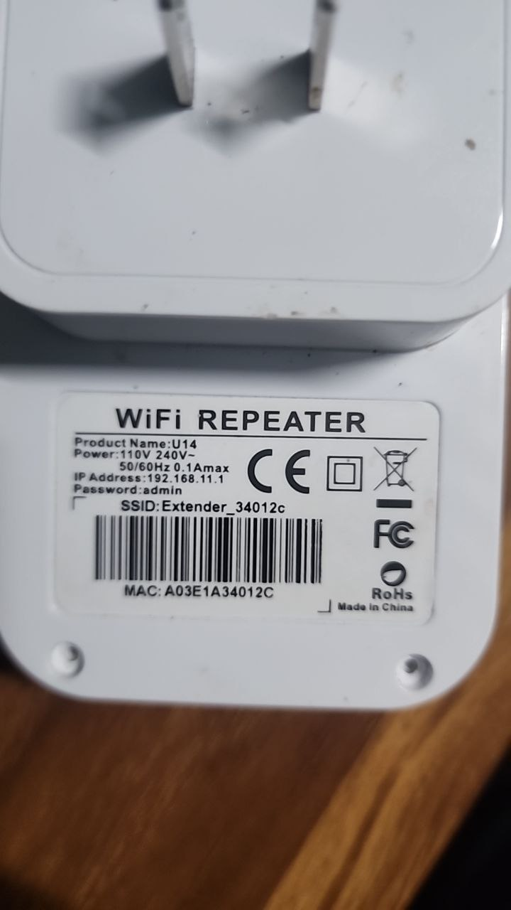
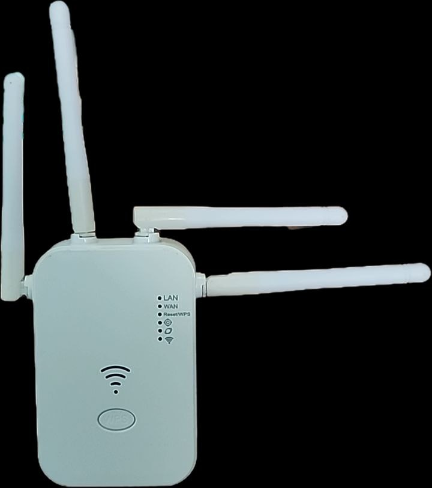
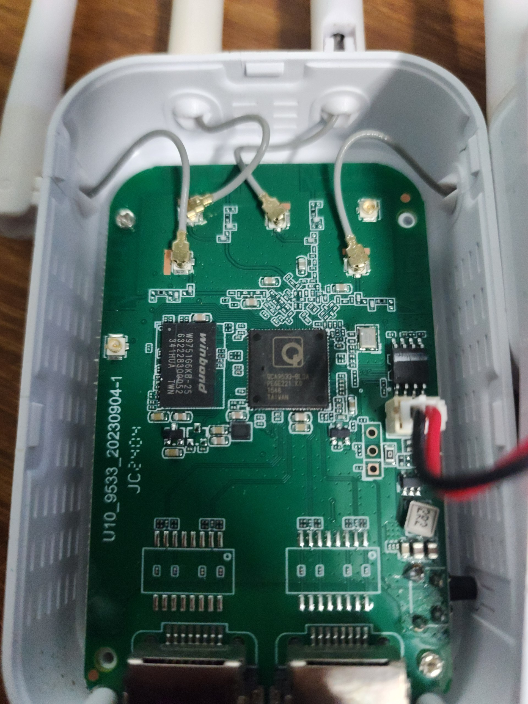
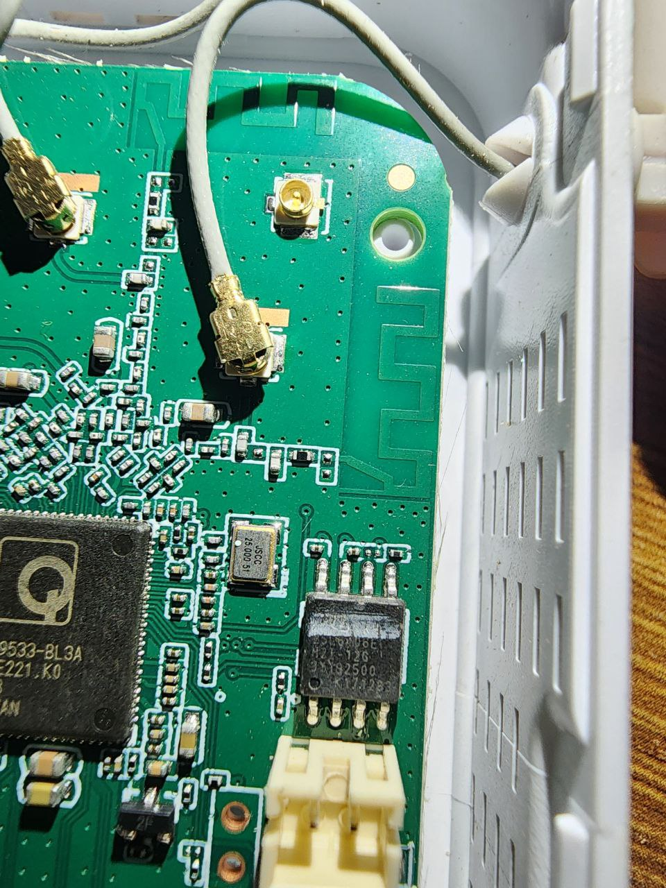

# OpenWrt Installation Guide for WiFi Repeater U14 (Breed to U-Boot)

A comprehensive guide for installing OpenWrt on the **WiFi Repeater U14** (generic Chinese router), transitioning from Breed bootloader to U-Boot.

## Hardware Specifications

| Component | Specification |
|-----------|---------------|
| **Product Name** | WiFi Repeater U14 |
| **PCB Model** | U10_9533_20230904-1 |
| **Manufacturer** | Generic Chinese (OEM) |
| **Antennas** | 4x External (2x 2.4GHz MIMO chains) |
| **Ethernet** | 1x WAN + 1x LAN (10/100 Mbps) |
| **USB** | None |
| **Power** | 110V-240V~ 50/60Hz 0.1A max (wall plug) |
| **Serial Console** | 115200 baud, 8N1 (3.3V TTL) |
| **Original Bootloader** | Breed (Chinese bootloader) |
| **Flash Layout** | LSDK/QSDK |

---

## Detailed Chip Information

### SoC: Qualcomm Atheros QCA9533-BL3A

| Parameter | Value |
|-----------|-------|
| **Full Part Number** | QCA9533-BL3A (E221.K0) |
| **Architecture** | MIPS 24Kc |
| **Clock Speed** | 550-650 MHz |
| **WiFi Standard** | IEEE 802.11 b/g/n |
| **WiFi Configuration** | 2x2:2 MIMO |
| **Max WiFi Speed** | 300 Mbps |
| **Ethernet Switch** | Integrated 5-port 10/100 Mbps |
| **Memory Interface** | DDR1/DDR2 @ 200/300 MHz |
| **Package** | DRQFN 12×12 mm |
| **Manufacturer** | Qualcomm Atheros (Taiwan) |

### RAM: Winbond W9751G6KB-25

| Parameter | Value |
|-----------|-------|
| **Full Part Number** | W9751G6KB-25 |
| **Type** | DDR2 SDRAM |
| **Capacity** | 512 Mbit (64 MB) |
| **Organization** | 32M × 16 bit |
| **Speed Grade** | DDR2-800 |
| **Data Bus Width** | 16-bit |
| **Voltage** | 1.7V - 1.9V |
| **Package** | WBGA-84 (84-pin Ball Grid Array) |
| **Manufacturer** | Winbond Electronics |

### Flash: Macronix MX25L6435E

| Parameter | Value |
|-----------|-------|
| **Full Part Number** | MX25L6435E |
| **Manufacturer** | Macronix International |
| **Type** | SPI NOR Flash |
| **Capacity** | 64 Mbit (8 MB) |
| **Interface** | SPI (Serial Peripheral Interface) |
| **Max Clock** | 104 MHz |
| **Voltage** | 2.7V - 3.6V |
| **Package** | SOP-8 (8-pin) |
| **Erase Size** | 4KB (sector), 64KB (block) |
| **Page Size** | 256 bytes |
| **JEDEC ID** | 0xC22017 |

### Crystal Oscillator

| Parameter | Value |
|-----------|-------|
| **Frequency** | 25.000 MHz |
| **Manufacturer** | JSQC |
| **Function** | Main system clock reference |

---

## Memory Map

```
Flash Memory Layout (8 MB = 0x800000 bytes):

+------------------+ 0x000000
|    Bootloader    |  128 KB (0x20000)
|    (U-Boot)      |
+------------------+ 0x020000
|   U-Boot Env     |  64 KB (0x10000)
+------------------+ 0x030000
|                  |
|    Firmware      |  ~7.75 MB
|   (Kernel +      |
|    RootFS)       |
|                  |
+------------------+ 0x7F0000
|    ART Data      |  64 KB (0x10000)
| (WiFi Calibration|
|      Data)       |
+------------------+ 0x800000
```

**IMPORTANT**: The ART (Atheros Radio Test) partition contains unique WiFi calibration data. Always backup before flashing!

## Factory Default Settings

| Setting | Value |
|---------|-------|
| IP Address | 192.168.11.1 |
| Username | admin |
| Password | admin |
| SSID | Extender_XXXXXX |

---

## Serial Console (UART)

For debugging and recovery, you can access the serial console.

| Parameter | Value |
|-----------|-------|
| **Baud Rate** | 115200 |
| **Data Bits** | 8 |
| **Parity** | None |
| **Stop Bits** | 1 |
| **Flow Control** | None |
| **Voltage Level** | 3.3V TTL (DO NOT use 5V!) |

### Serial Pinout

```
    [GND] [RX] [TX] [VCC]
      ●     ●    ●    ○     (VCC not needed, leave unconnected)
```

**Connection to USB-TTL adapter:**
- Router TX → Adapter RX
- Router RX → Adapter TX  
- Router GND → Adapter GND

### Recommended USB-TTL Adapters
- CP2102
- CH340G
- FT232RL
- PL2303

---

## SPI Flash Programmer Recovery

If the router is bricked (no boot, no serial output), you can recover using an SPI programmer.

### Required Equipment
- CH341A USB Programmer (or similar)
- SOIC-8 test clip or direct soldering
- Software: AsProgrammer, flashrom, or CH341A Programmer

### SPI Flash Pinout (SOP-8)

```
        ┌──────────┐
   CS# ─┤1       8├─ VCC (3.3V)
    DO ─┤2       7├─ HOLD#
   WP# ─┤3       6├─ CLK
   GND ─┤4       5├─ DI
        └──────────┘
```

### Recovery Procedure

1. **Backup first** (if possible): Read entire 8MB flash
2. **Erase**: Full chip erase
3. **Write**: Flash the backup or new firmware
4. **Verify**: Compare written data with source file

### Important Files to Backup
- Full flash dump (8 MB)
- ART partition (last 64 KB) - **Contains unique WiFi calibration!**

## GPIO Configuration

| Function | GPIO | Notes |
|----------|------|-------|
| Reset Button | GPIO 17 | Active low |
| System LED | GPIO 13 | Active low |
| Red LED | GPIO 11 | Active low |
| Green LED | GPIO 4 | Active low |

## Compatible OpenWrt Firmware

This device uses **QCA9533** SoC which is compatible with OpenWrt ath79/generic target. 
The firmware used is based on **TP-Link TL-WR810N v1** profile (same SoC, similar hardware):

```bash
# OpenWrt 24.10.5 (ath79/generic)
openwrt-24.10.5-ath79-generic-tplink_tl-wr810n-v1-squashfs-sysupgrade.bin
```

**Note**: This is NOT the Letv LBA-047-CH. The Breed bootloader identifies it as "Letv LBA-047-CH" but the actual hardware is a generic U14 WiFi Repeater.

## Device Photos

### Product Label


**Key Info from label:**
- Product Name: U14
- IP: 192.168.11.1
- Password: admin
- MAC: A03E1A34012C

### Front View (LEDs)


**LED indicators:** LAN, WAN, Reset/WPS, WiFi Signal

### PCB - Full Board


**PCB Model:** U10_9533_20230904-1

### PCB - SoC and Flash Detail


**Chips visible:**
- QCA9533-BL3A (Main SoC)
- Winbond RAM chip
- 8-pin SPI Flash

## Table of Contents

1. [Prerequisites](#prerequisites)
2. [Backup Original Firmware](#backup-original-firmware)
3. [Flash U-Boot via Breed](#flash-u-boot-via-breed)
4. [Install OpenWrt](#install-openwrt)
5. [Post-Installation Configuration](#post-installation-configuration)
6. [Troubleshooting](#troubleshooting)
7. [Recovery](#recovery)

---

## Prerequisites

### Required Tools
- Computer with Ethernet port
- Ethernet cable
- Web browser
- (Optional) USB-TTL adapter for serial console
- (Optional) CH341A programmer for emergency recovery

### Required Files
- `u-boot_mod` binary for QCA953X ([pepe2k/u-boot_mod](https://github.com/pepe2k/u-boot_mod))
- OpenWrt firmware for ath79/generic target
- Original firmware backup (recommended)

### Network Setup
1. Set your computer's IP to `192.168.1.2` (static)
2. Subnet mask: `255.255.255.0`
3. Gateway: `192.168.1.1`

---

## Backup Original Firmware

### Via Breed Web Interface

1. Access Breed at `http://192.168.1.1`
2. Hold **RESET** button while powering on (5 seconds)
3. Navigate to **Firmware Backup**
4. Download:
   - Full Flash dump (8MB)
   - Bootloader
   - ART/Calibration data

### Via Serial Console (if available)

```bash
# Connect at 115200 baud
breed> flash dump 0x0 0x800000
```

**IMPORTANT**: Keep backups in a safe place. The ART partition contains unique WiFi calibration data.

---

## Custom U-Boot (Compiled for this Router)

We compiled a custom **U-Boot 1.1.4** based on [pepe2k/u-boot_mod](https://github.com/pepe2k/u-boot_mod) specifically for this router with the correct GPIO configuration.

### Recovery Modes (Reset Button)

**IMPORTANT**: Press and HOLD the reset button BEFORE connecting power, then plug in the router while keeping the button pressed.

| Hold Time | Mode | Description |
|-----------|------|-------------|
| **~3 seconds** | Web Recovery | HTTP server at 192.168.1.1 for firmware/bootloader upload |
| **~5 seconds** | U-Boot Console | Serial console access (115200 baud) |
| **~7 seconds** | NetConsole | UDP console over Ethernet (port 6666) |

### Web Recovery Interface

After holding reset for ~3 seconds and releasing:
- Access: `http://192.168.1.1`
- Upload firmware, U-Boot, or ART images
- No serial console or TFTP required

### NetConsole Mode (Advanced)

After holding reset for ~7 seconds:
```bash
# On your PC (Linux/macOS)
nc -u 192.168.1.1 6666

# Or use netcat to send commands
echo "help" | nc -u 192.168.1.1 6666
```

### U-Boot Compilation Details

The U-Boot was compiled with these settings for WiFi Repeater U14:

```makefile
# GPIO Configuration
GPIO_RESET_BUTTON = 17
GPIO_LED_SYSTEM = 13
GPIO_LED_RED = 11  
GPIO_LED_GREEN = 4
ACTIVE_LOW = 1

# Hardware
SOC = QCA9533
RAM = 64MB DDR2
FLASH = 8MB SPI
```

### U-Boot Source Files

- Repository: https://github.com/pepe2k/u-boot_mod
- Board config: `u-boot/include/configs/ap143.h` (modified)
- Binary output: `uboot_Compiled_working.bin`

### After Flashing Custom U-Boot

Once the custom U-Boot is flashed, to enter recovery:

1. **Disconnect** the router from power
2. **Press and HOLD** the reset button (GPIO 17)
3. **Connect** power while holding the button
4. **Hold for ~3 seconds** → Web recovery at `http://192.168.1.1`
5. **Hold for ~5 seconds** → Serial console mode
6. **Hold for ~7 seconds** → NetConsole (UDP port 6666)

---

## About Breed Bootloader (Original)

Breed is a popular Chinese bootloader with web recovery interface. On the Letv LBA-047-CH:

- **Access**: Hold RESET button while powering on for 5 seconds
- **Web URL**: `http://192.168.1.1`
- **Flash Layout**: LSDK/QSDK (select in dropdown when flashing)
- **Language**: Chinese (use browser translation)

### Breed Web Interface Options

| Chinese | English |
|---------|---------|
| 系统信息 | System Info |
| 固件更新 | Firmware Update |
| 固件备份 | Firmware Backup |
| 频率设置 | Frequency Settings |
| 恢复出厂设置 | Factory Reset |
| 环境变量编辑 | Environment Variables |
| Breed 保护设置 | Breed Protection |
| 重启 | Reboot |
| 关于 | About |

### Breed Console Commands

```bash
breed> help              # Show available commands
breed> sysinfo           # Display system information
breed> flash dump 0x0 64 # Dump flash content
breed> env list          # List environment variables
breed> reset             # Reboot device
```

---

## Flash Custom U-Boot via Breed

### How to Enter Breed Recovery

1. **Disconnect** the router from power
2. **Press and HOLD** the reset button
3. **While holding**, connect the power
4. **Keep holding** for 5 seconds
5. **Release** the button
6. Access `http://192.168.1.1` in your browser

### Option 1: Web Interface (Recommended)

1. Access Breed web recovery: `http://192.168.1.1`
2. Go to **Firmware Update** → **Bootloader**
3. Select the U-Boot binary file
4. Click **Upload** and wait for completion
5. Router will reboot automatically

### Option 2: Console Commands

```bash
# Start TFTP server on your PC with u-boot binary

# In Breed console:
breed> wget 0x81000000 http://192.168.1.2/u-boot.bin
breed> flash erase 0x0 0x20000
breed> flash write 0x0 0x81000000 0x20000
breed> reset
```

### U-Boot Memory Map

| Partition | Offset | Size |
|-----------|--------|------|
| u-boot | 0x000000 | 128 KB |
| u-boot-env | 0x020000 | 64 KB |
| firmware | 0x030000 | 7.75 MB |
| art | 0x7F0000 | 64 KB |

---

## Install OpenWrt

### Via U-Boot Web Recovery

After flashing U-Boot, if boot fails it automatically starts a web server:

1. Connect to `http://192.168.1.1`
2. Upload OpenWrt sysupgrade image
3. Wait for flash and automatic reboot

### Via U-Boot Console

```bash
# TFTP method
u-boot> tftpboot 0x81000000 openwrt-sysupgrade.bin
u-boot> erase 0x9F030000 +0x7C0000
u-boot> cp.b 0x81000000 0x9F030000 ${filesize}
u-boot> reset

# HTTP method (if supported)
u-boot> httpd
# Then upload via web browser
```

### Via OpenWrt (Sysupgrade)

If already running OpenWrt:

```bash
sysupgrade -v /tmp/openwrt-sysupgrade.bin
```

---

## Post-Installation Configuration

### First Access

- **IP**: `192.168.1.1`
- **User**: `root`
- **Password**: (none, set on first login)

### Set Root Password

```bash
passwd
```

### Configure WiFi

```bash
# Enable WiFi
uci set wireless.radio0.disabled='0'
uci set wireless.default_radio0.ssid='YourSSID'
uci set wireless.default_radio0.encryption='psk2'
uci set wireless.default_radio0.key='YourPassword'
uci commit wireless
wifi reload
```

### Configure as WiFi Repeater

```bash
# Connect to upstream WiFi (client mode)
uci set wireless.sta0=wifi-iface
uci set wireless.sta0.device='radio0'
uci set wireless.sta0.network='wwan'
uci set wireless.sta0.mode='sta'
uci set wireless.sta0.ssid='UpstreamSSID'
uci set wireless.sta0.encryption='psk2'
uci set wireless.sta0.key='UpstreamPassword'

# Create WWAN interface
uci set network.wwan=interface
uci set network.wwan.proto='dhcp'

uci commit
/etc/init.d/network restart
```

---

## Troubleshooting

### U-Boot Shows "Unsupported Image Header"

The firmware image format is incompatible. Solutions:
1. Use factory image instead of sysupgrade
2. Check image is for correct target (ath79/generic)
3. Verify image integrity (checksum)

### OpenWrt Doesn't Boot (LZMA Error)

Breed's LZMA decompressor may be outdated:
1. Flash U-Boot first (has modern LZMA support)
2. Then flash OpenWrt via U-Boot

### No WiFi After Installation

```bash
# Check if radio is enabled
uci show wireless.radio0.disabled

# Enable if disabled
uci set wireless.radio0.disabled='0'
uci commit wireless
wifi
```

### Can't Access Web Interface

```bash
# Check uhttpd is running
/etc/init.d/uhttpd status

# Start if not running
/etc/init.d/uhttpd start
/etc/init.d/uhttpd enable
```

### Lost Access to Router

1. Wait 90 seconds for failsafe mode timeout
2. Hold RESET while booting to enter failsafe
3. Connect via `192.168.1.1`
4. Run `firstboot && reboot`

---

## Recovery

### If Router is Bricked

#### Method 1: U-Boot Web Recovery
1. Hold RESET button while powering on
2. Wait 3 seconds
3. Access `http://192.168.1.1`
4. Upload working firmware

#### Method 2: Serial Console + TFTP
1. Connect USB-TTL adapter (115200 baud)
2. Interrupt boot process
3. Use TFTP to upload firmware

#### Method 3: SPI Flash Programmer
1. Desolder or use clip on flash chip
2. Use CH341A programmer
3. Flash full backup image
4. Resolder if needed

### GPIO Reference (WiFi Repeater U14 / PCB U10_9533)

| Function | GPIO | Active |
|----------|------|--------|
| Reset Button | 17 | Low |
| System LED | 13 | Low |
| Red LED | 11 | Low |
| Green LED | 4 | Low |

**Note**: These GPIOs were extracted from the original firmware. The device uses QCA9533 reference design.

---

## Download Compatible OpenWrt Firmware

Since this is a generic device without official OpenWrt support, we use a compatible profile (TP-Link TL-WR810N v1 - same QCA9533 SoC):

### Stable Release (Recommended)

```bash
# OpenWrt 24.10.5 (ath79/generic - TL-WR810N v1 profile)
wget https://downloads.openwrt.org/releases/24.10.5/targets/ath79/generic/openwrt-24.10.5-ath79-generic-tplink_tl-wr810n-v1-squashfs-sysupgrade.bin
```

### Alternative: OpenWrt 23.05.5

```bash
wget https://downloads.openwrt.org/releases/23.05.5/targets/ath79/generic/openwrt-23.05.5-ath79-generic-tplink_tl-wr810n-v1-squashfs-sysupgrade.bin
```

**Why TL-WR810N v1?**
- Same SoC (QCA9533)
- Same flash size (8MB)
- Same RAM (64MB DDR2)
- Compatible GPIO layout

---

## Recommended OpenWrt Packages

```bash
opkg update
opkg install luci                    # Web interface
opkg install wpad-basic-mbedtls      # WiFi WPA support
```

---

## References

- [OpenWrt Table of Hardware](https://openwrt.org/toh/start)
- [U-Boot Mod by pepe2k](https://github.com/pepe2k/u-boot_mod)
- [OpenWrt ath79 Target](https://openwrt.org/docs/techref/targets/ath79)
- [Breed Bootloader](https://breed.hackpascal.net/)

---

## Downloads

### Pre-compiled Binaries

| File | Description | Size |
|------|-------------|------|
| [uboot_Compiled_working.bin](binaries/uboot_Compiled_working.bin) | Custom U-Boot for WiFi Repeater U14 (GPIO 17 reset) | 123 KB |
| [wifi_calibration_art.bin](binaries/wifi_calibration_art.bin) | ART partition backup (WiFi calibration data) | 64 KB |

**Note**: The ART file is specific to one device. Your device has unique calibration data - always backup your own ART partition before flashing!

---

## Author

**Created by Lordlock**

- Telegram: [t.me/lordlock](https://t.me/lordlock)
- GitHub: [@fidelhacker13](https://github.com/fidelhacker13)

This project documents the complete process of:
- Analyzing generic Chinese router hardware
- Compiling custom U-Boot bootloader with correct GPIO configuration  
- Installing modern OpenWrt on legacy Breed bootloader devices

---

## License

This guide is provided as-is without warranty. Use at your own risk.

## Contributing

Pull requests welcome! Please test on actual hardware before submitting.

---

## Support

If this guide helped you, consider:
- Starring this repository
- Sharing with others who have similar hardware
- Contributing improvements or translations

Contact: [t.me/lordlock](https://t.me/lordlock)
